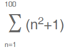

#函数

我们知道圆的面积计算公式为：

S = πr2

当我们知道半径r的值时，就可以根据公式计算出面积。假设我们需要计算3个不同大小的圆的面积：

    r1 = 12.34
    r2 = 9.08
    r3 = 73.1
    s1 = 3.14 * r1 * r1
    s2 = 3.14 * r2 * r2
    s3 = 3.14 * r3 * r3

当代码出现有规律的重复的时候，你就需要当心了，每次写3.14 * x * x不仅很麻烦，而且，如果要把3.14改成3.14159265359的时候，得全部替换。

有了函数，我们就不再每次写s = 3.14 * x * x，而是写成更有意义的函数调用`s = area_of_circle(x)`，而函数`area_of_circle`本身只需要写一次，就可以多次调用。

基本上所有的高级语言都支持函数，Python也不例外。Python不但能非常灵活地定义函数，而且本身内置了很多有用的函数，可以直接调用。

##抽象

抽象是数学中非常常见的概念。举个例子：

计算数列的和，比如：1 + 2 + 3 + ... + 100，写起来十分不方便，于是数学家发明了求和符号∑，可以把1 + 2 + 3 + ... + 100记作：

这种抽象记法非常强大，因为我们看到 ∑ 就可以理解成求和，而不是还原成低级的加法运算。

而且，这种抽象记法是可扩展的，比如：

还原成加法运算就变成了：

(1 x 1 + 1) + (2 x 2 + 1) + (3 x 3 + 1) + ... + (100 x 100 + 1)

可见，借助抽象，我们才能不关心底层的具体计算过程，而直接在更高的层次上思考问题。

写计算机程序也是一样，函数就是最基本的一种代码抽象的方式。

#调用函数

Python内置了很多有用的函数，我们可以直接调用。

要调用一个函数，需要知道函数的名称和参数，比如求绝对值的函数abs，只有一个参数。可以直接从Python的官方网站查看文档：

[https://docs.python.org/3/library/functions.html#abs](https://docs.python.org/3/library/functions.html#abs)

调用abs函数：

    >>> abs(100)
    100
    >>> abs(-20)
    20
    >>> abs(12.34)
    12.34

调用函数的时候，如果传入的参数数量不对，会报TypeError的错误，并且Python会明确地告诉你：abs()有且仅有1个参数，但给出了两个：

    >>> abs(1, 2)
    Traceback (most recent call last):
      File "<stdin>", line 1, in <module>
    TypeError: abs() takes exactly one argument (2 given)

如果传入的参数数量是对的，但参数类型不能被函数所接受，也会报TypeError的错误，并且给出错误信息：str是错误的参数类型：

    >>> abs('a')
    Traceback (most recent call last):
      File "<stdin>", line 1, in <module>
    TypeError: bad operand type for abs(): 'str'

而max函数max()可以接收任意多个参数，并返回最大的那个：

    >>> max(1, 2)
    2
    >>> max(2, 3, 1, -5)
    3

##数据类型转换

Python内置的常用函数还包括数据类型转换函数，比如int()函数可以把其他数据类型转换为整数：

    >>> int('123')
    123
    >>> int(12.34)
    12
    >>> float('12.34')
    12.34
    >>> str(1.23)
    '1.23'
    >>> str(100)
    '100'
    >>> bool(1)
    True
    >>> bool('')
    False

函数名其实就是指向一个函数对象的引用，完全可以把函数名赋给一个变量，相当于给这个函数起了一个“别名”：

    >>> a = abs # 变量a指向abs函数
    >>> a(-1) # 所以也可以通过a调用abs函数
    1

#定义函数

在Python中，定义一个函数要使用def语句，依次写出函数名、括号、括号中的参数和冒号:，然后，在缩进块中编写函数体，函数的返回值用return语句返回。

我们以自定义一个求绝对值的my_abs函数为例：

    def my_abs(x):
        if x >= 0:
            return x
        else:
            return -x

请注意，函数体内部的语句在执行时，一旦执行到return时，函数就执行完毕，并将结果返回。因此，函数内部通过条件判断和循环可以实现非常复杂的逻辑。

如果没有return语句，函数执行完毕后也会返回结果，只是结果为None。

return None可以简写为return。

如果你已经把`my_abs()`的函数定义保存为abstest.py文件了，那么，可以在该文件的当前目录下启动Python解释器，用`from abstest import my_abs`来导入`my_abs()`函数，注意abstest是文件名（不含.py扩展名）：

##空函数

如果想定义一个什么事也不做的空函数，可以用pass语句：

    def nop():
        pass

pass语句什么都不做，那有什么用？实际上pass可以用来作为占位符，比如现在还没想好怎么写函数的代码，就可以先放一个pass，让代码能运行起来。

pass还可以用在其他语句里，比如：

    if age >= 18:
        pass

缺少了pass，代码运行就会有语法错误。

##参数检查

调用函数时，如果参数个数不对，Python解释器会自动检查出来，并抛出TypeError：

    >>> my_abs(1, 2)
    Traceback (most recent call last):
      File "<stdin>", line 1, in <module>
    TypeError: my_abs() takes 1 positional argument but 2 were given

但是如果参数类型不对，Python解释器就无法帮我们检查。试试my_abs和内置函数abs的差别：

    >>> my_abs('A')
    Traceback (most recent call last):
      File "<stdin>", line 1, in <module>
      File "<stdin>", line 2, in my_abs
    TypeError: unorderable types: str() >= int()
    >>> abs('A')
    Traceback (most recent call last):
      File "<stdin>", line 1, in <module>
    TypeError: bad operand type for abs(): 'str'

当传入了不恰当的参数时，内置函数abs会检查出参数错误，而我们定义的my_abs没有参数检查，会导致if语句出错，出错信息和abs不一样。所以，这个函数定义不够完善。

让我们修改一下my_abs的定义，对参数类型做检查，只允许整数和浮点数类型的参数。数据类型检查可以用内置函数isinstance()实现：

    def my_abs(x):
        if not isinstance(x, (int, float)):
            raise TypeError('bad operand type')
        if x >= 0:
            return x
        else:
            return -x

添加了参数检查后，如果传入错误的参数类型，函数就可以抛出一个错误：

    >>> my_abs('A')
    Traceback (most recent call last):
      File "<stdin>", line 1, in <module>
      File "<stdin>", line 3, in my_abs
    TypeError: bad operand type

错误和异常处理将在后续讲到。

##返回多个值

函数可以返回多个值吗？答案是肯定的。

比如在游戏中经常需要从一个点移动到另一个点，给出坐标、位移和角度，就可以计算出新的新的坐标：

    import math

    def move(x, y, step, angle=0):
        nx = x + step * math.cos(angle)
        ny = y - step * math.sin(angle)
        return nx, ny

import math语句表示导入math包，并允许后续代码引用math包里的sin、cos等函数。

然后，我们就可以同时获得返回值：

    >>> x, y = move(100, 100, 60, math.pi / 6)
    >>> print(x, y)
    151.96152422706632 70.0

但其实这只是一种假象，Python函数返回的仍然是单一值：

    >>> r = move(100, 100, 60, math.pi / 6)
    >>> print(r)
    (151.96152422706632, 70.0)

原来返回值是一个tuple！但是，在语法上，返回一个tuple可以省略括号，而多个变量可以同时接收一个tuple，按位置赋给对应的值，所以，Python的函数返回多值其实就是返回一个tuple，但写起来更方便。

##小结

定义函数时，需要确定函数名和参数个数；

如果有必要，可以先对参数的数据类型做检查；

函数体内部可以用return随时返回函数结果；

函数执行完毕也没有return语句时，自动return None。

函数可以同时返回多个值，但其实就是一个tuple。